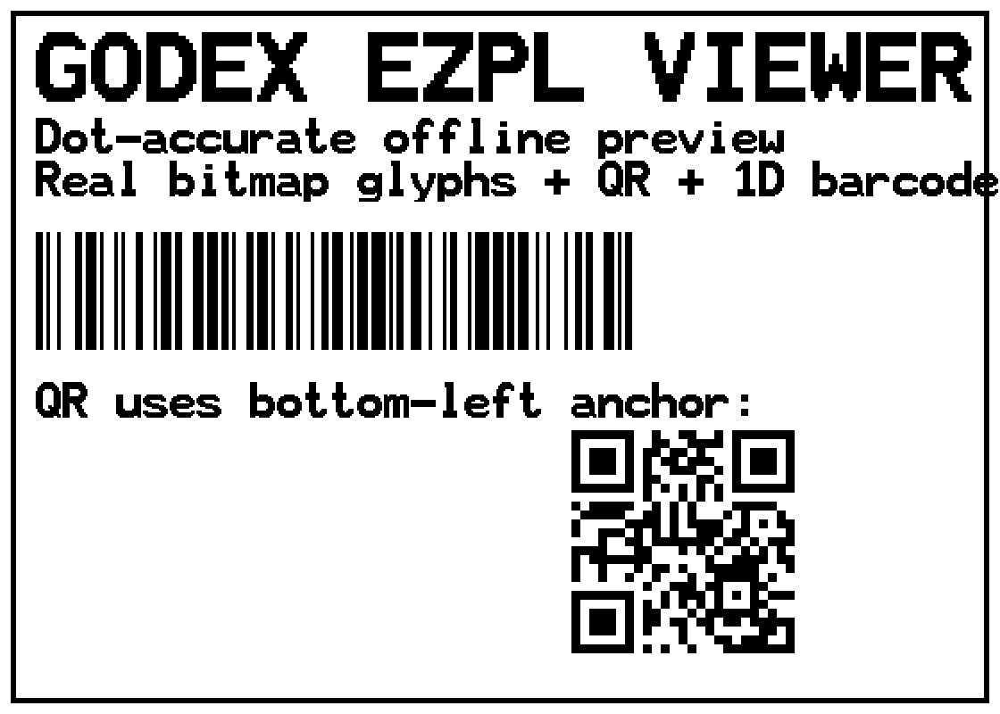

# Godex EZPL Viewer

A single-file, **offline**, **dot-accurate** browser previewer for **Godex EZPL** label code.

Paste the raw EZPL you send to the printer and see what should come off the label, *before* you
waste a roll. Online ZPL/EZPL viewers get fonts, sizes, alignment and the QR position wrong because
EZPL has several non-obvious rules. This tool implements those rules by reverse-engineering Godex's
own tooling and the official EZPL manual.

**▶ Live demo:** https://yibudak.github.io/godex-ezpl-viewer/ *(see "Hosting" below)*



> No printer, no install, no network. One HTML file. Drop it on GitHub Pages and share the link.

---

## Why labels don't match the viewers (the rules this tool gets right)

All of the following were derived from decompiling Godex's GoLabel design software, cross-checked
against the official *EZPL Programmer's Manual* and verified by decoding the generated barcodes/QR:

| Rule | What most viewers get wrong | What EZPL actually does |
|------|-----------------------------|--------------------------|
| **Units** | use 25.4 dots/mm | **fixed 8 / 12 / 24 dot/mm** for 203 / 300 / 600 dpi |
| **Coordinates** | mixed | object X/Y and sizes are in **dots**; only `^Q`/`^W` are in mm |
| **TrueType size** (`AT`) | treats the field as points | the `w,h` fields are **dots** = `round(pt × dpi / 72)` |
| **Bitmap size** (`At`) | treats as pixels | integer **zoom** of a fixed per-slot cell (A=6pt … H=30pt) |
| **QR anchor** (`W`) | top-left | **bottom-left** — the symbol grows *upward* from Y |
| **Alignment** | expects an align field | there is none; X is the exact left edge |
| **Output** | smooth antialiased | printer is **1-bit** — no grey, hard edges |

See [`docs/EZPL.md`](docs/EZPL.md) for the full command reference and field-by-field breakdown.

---

## Features

- **EZPL parser + renderer** for the common commands: `^Q/^QD/^W` (label size), `^L … E` block,
  `At` (bitmap text), `AT`/`ATt` (TrueType), `Vt` (downloaded bitmap), `Bt` (1D barcode),
  `W` (QR), `Rx` (box), `La` (line), `Hx` (table).
- **Dot-exact geometry** with the correct anchors (incl. bottom-left QR).
- **Built-in QR encoder** (ISO/IEC 18004, byte mode, auto version/mask, Reed–Solomon) — verified by
  round-tripping through the [jsQR](https://github.com/cozmo/jsQR) decoder.
- **Built-in 1D barcode encoders** — Code 128, Code 39 (+full ASCII/check), Code 93, EAN-13, EAN-8,
  UPC-A, ITF (Interleaved 2 of 5), Codabar — verified by decoding with [ZXing](https://github.com/zxing-js/library).
  Rarer symbologies render as correctly-dimensioned placeholders.
- **1-bit thermal thresholding** so the preview looks like real thermal output (toggleable).
- **Real-size 1:1** mode with an on-screen ruler so you can calibrate against a physical print
  (the only 100% reference).
- **Bring your own fonts** (see below) for exact glyph matching.

Everything runs locally in your browser. No data leaves the page.

---

## Fonts & accuracy

Type rendering is the hardest part to match. This tool ships **only open fonts** and lets you load
your printer's own fonts for an exact match:

- **`AT` / TrueType text** — rendered with bundled **Noto Serif** (SIL OFL). Godex's recent firmware
  uses the **Noto** family as its internal scalable fonts, so this is both legally clean and a close
  match. You can also load any `.ttf`/`.otf` (e.g. your printer's actual font) via **AT font**.
- **`At` / bitmap fonts (A…H)** — emulated with a system font by default. For **pixel-exact** glyphs,
  load *your* printer's bitmap-font ROM via **Bitmap ROM**. You can either:
  - point it at the **decompressed ROM** produced by [`tools/extract_godex_fonts.py`](tools/extract_godex_fonts.py), or
  - drop a **raw Godex firmware `.bin`** directly — the page finds the embedded `GODEX2GCompress`
    zlib stream and inflates it in the browser (`DecompressionStream`).

> **No proprietary font data is bundled in this repo.** Bitmap glyphs come from *your own* firmware,
> which you already have if you own the printer.

---

## Quick start

1. Open `index.html` (double-click, or host it).
2. Pick a sample or paste your own EZPL.
3. Choose the printer DPI (203 / 300 / 600), zoom, optional 1-bit and grid.
4. *(Optional)* load your printer's bitmap ROM / a custom TTF for exact glyphs.
5. *(Optional)* enable **real size 1:1**, print one label, measure the on-screen ruler with a real
   ruler, and **Calibrate** so the screen matches physical mm.

### Hosting on GitHub Pages

1. Create a repo named **`godex-ezpl-viewer`** on your account.
2. Push this folder:
   ```bash
   git remote add origin https://github.com/yibudak/godex-ezpl-viewer.git
   git push -u origin main
   ```
3. On GitHub: **Settings → Pages → Source: `main` / root**.
4. The site appears at **`https://yibudak.github.io/godex-ezpl-viewer/`** within ~1 min.

(A `.nojekyll` file is included so Pages serves the HTML untouched. If you fork it under a different
account, update the URLs in `index.html`'s `<head>` meta tags so social/Google previews point to your
own address.)

---

## Extracting your printer's fonts (optional)

If you have a Godex firmware package (the `DownloadTool` `.zip`s contain `.BIN` files), you can pull
out the real fonts:

```bash
python tools/extract_godex_fonts.py path/to/firmware_folder_or.bin -o out/
```

It will:
- find the **`GODEX2GCompress`** zlib stream and write the decompressed **bitmap-font ROM**
  (load this in the viewer for exact `At` glyphs), and
- split any **`~H,TTF,…`** "internal TTF" image into the individual **TrueType files** (these are
  Noto fonts; load the Latin one as your **AT font**).

This is interoperability tooling — it only reads firmware **you already own**. Don't redistribute
the extracted proprietary fonts.

---

## How it was built

Decompile GoLabel (it's .NET, so ILSpy rather than IDA) to learn how it turns a design into EZPL;
confirm the wire format against the official manual; encode QR/barcodes to spec and verify by
*decoding* them; and, for the resident bitmap fonts, inflate the `GODEX2GCompress` block from
firmware and reverse the 16×24 glyph layout. The notes live in [`docs/EZPL.md`](docs/EZPL.md).

## License

- **Code:** MIT — see [`LICENSE`](LICENSE).
- **Bundled font:** Noto Serif under the SIL Open Font License 1.1 — see [`fonts/OFL.txt`](fonts/OFL.txt).
- "Godex" and "EZPL" are trademarks of their owner. This is an independent, unaffiliated
  interoperability tool. No printer-vendor source code or proprietary font binaries are included.

## Acknowledgements

- The official *EZPL Programmer's Manual* for the authoritative command syntax.
- [jsQR](https://github.com/cozmo/jsQR) and [ZXing](https://github.com/zxing-js/library) — used
  during development to verify the encoders (not bundled in the page).
- The [Noto](https://fonts.google.com/noto) project.
